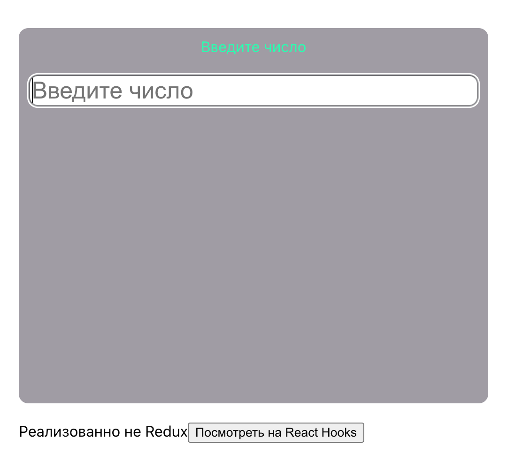
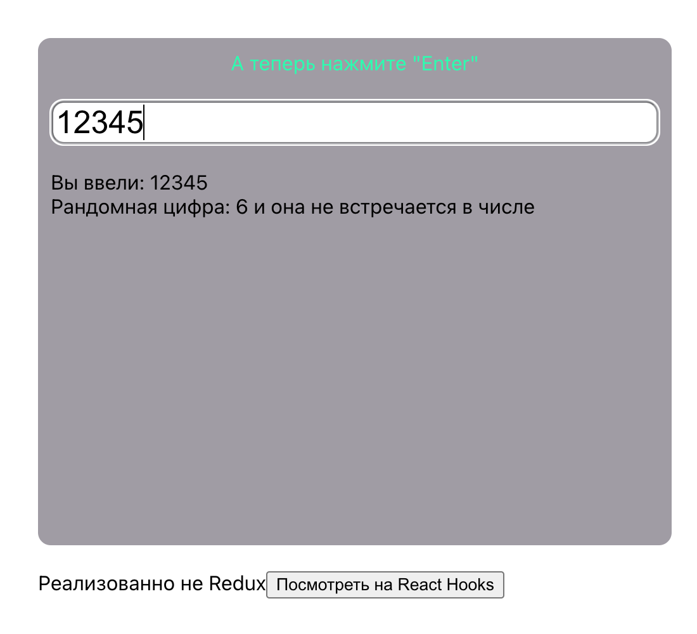

# Random-task

___

The application receives a number from the user, then generates a random digit (0-9) and reports if this digit is contained in the user's number.

Implemented on **React Hooks** and on **Redux**
___

